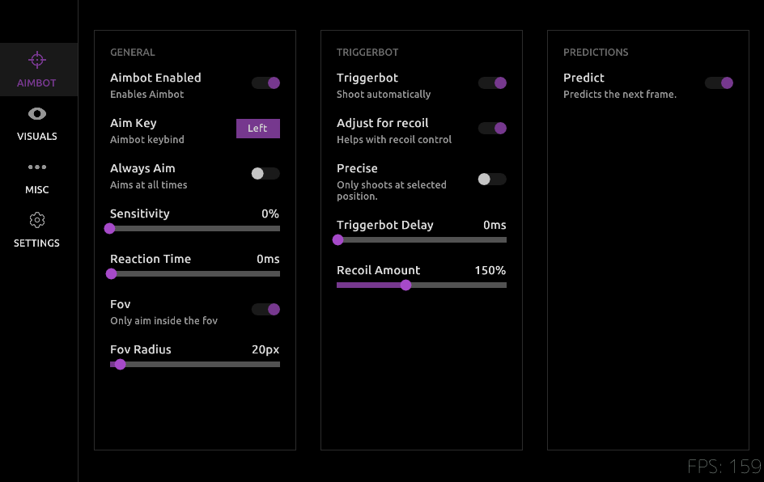

# AimAhead: The fastest AI powered Aim Assist

**AimAhead was built from the ground up with speed and features in mind. Depending on the model, it can reach anywhere from 100 to 200 cycles per second.**

AimAhead works by capturing your screen, then running it through an AI model of your liking to find the enemies, after which it aims towards them.

## Features

*   **AI:**  AimAhead uses AI to see enemies and lock onto them fast.
*   **Optimized for NVIDIA Cards:**  All onnx models are converted to a TensorRT engine file before use, which means it optimizes it for your GPU
*   **Triggerbot:** Reacts within the first frame that an Enemy is visible

    *   **Auto-Fire:** When the triggerbot key is being held down, and an enemy pops up, it will first aim if needed, and then shoot.
    *   **Recoil Control:**  Recoil Control helps to control the recoil when triggerbot is active
    *   **Firing Delay:** You can add a delay to make the reaction time look more natural

*   **Predictions:**  To cope with fast moving enemies, AimAhead can predict the next frame and know where the enemy is before the frame even renders
    *   **Prediction Settings:** You can change the amount of frames that need to be collected before making a prediction

*   **Targeting Modes:**  Controls on how the target is selected

    *   **Targeting Modes:**
        *   **"Objective":** Chooses the target that has the highest confidence score
        *   **"Closest":**  Chooses the target that is the closest to the crosshair
    *   **Aim Positions:**
        *   **Heads (Top):**  Aims for the head.
        *   **Body (Middle):**  Aims for the body

*   **Anti Jitter:** Helps to cope with jittering between multiple enemies when multiple enemies are visible

*   **Misc:**  Some extras if you like to tinker or help out with development:

    *   **Auto Data Collection:**  Automatically saves frames of AI's detections to the data folder. Useful when you want to train/improve an AI model. Off by default
    *   **Only run when cursor is hidden:** AimAhead will only aim whenever you are in-game, this is detected by the fact if your cursor is hidden. Off by default
    *   **Frame Rate Control:**  You can set AimAhead to run at a X amount of times per second to avoid overloading the GPU
    *   **Model Selector:**  Easily switch between different AI models

*   **ESP:**  Get some visual feedback on screen:

    *   **Show Detected targets:**  Draws detected targets on  screen.

## Requirements

*   **NVIDIA Graphics Card:**  Only works on NVIDIA GPUs
*   **CUDA 12.4:**  Cuda 12.4, download it from [NVIDIA CUDA Toolkit Archive](developer.nvidia.com/cuda-12-4-0-download-archive).

## Importing a model

1.  **Drop your ONNX models** into the folder called `models`.
2.  When you fire up AimAhead, it'll see the models you put in there.
3.  **First time loading a model, it does some magic.**  It makes the model super-fast for your GPU. This might take a few minutes the very first time, but it's a one-time thing. After that, models load super quick.

## Setup

1.  **Install Cuda 12.4:** Make sure you've got an NVIDIA card and CUDA 12.4 installed ([See "Requirements" section](#Requirements)).
2.  **Get AimAhead:** Download the latest version from the [GitHub Releases page](https://github.com/ShufflePerson/AimAhead/releases)
3.  **Models In Place:**  Put your ONNX models into the `models` folder. A Fortnite Ballistic model is shipped by default
4.  **Run It!:**  Start the AimAhead program.
5.  **Set It Up:**  Adjust the config
6.  **Done!**

## How to use

*   To open/close the menu, click [INS] ( insert ) on your keyboard. It is next to the HOME key.
*   To use the **INT8** mode, place at least a few thousand training images inside the bin\int8 directory. 
*   To use the Geforce Now mode, first enable it, then make sure that Geforce Now is closed and click "Inject". After that launch Geforce Now. Done.
*   The default triggerbot key is X, when X is being held down, Triggerbot will shoot as soon as the target is visible.

## Todo / Bugs
*   Unable to change Aim Keybind
*   Custom Listbox for Models tab and selecting the aim position.

**Good Luck!**